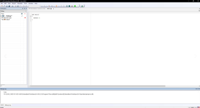
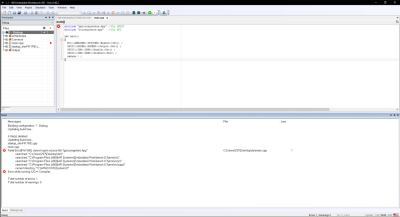
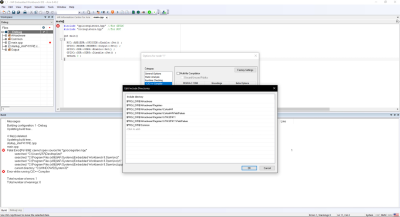
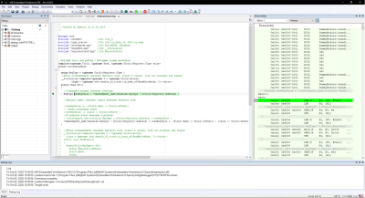
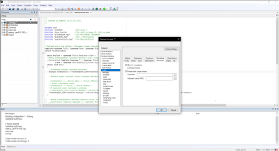
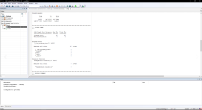
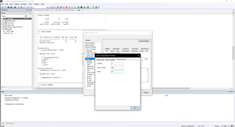
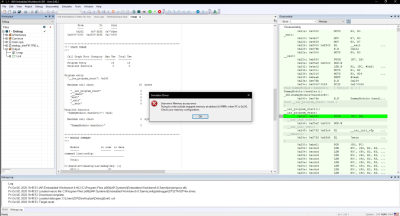

=== Лабораторная работа №1
1) Создаем проект C++ c main.cpp

.Скрин 1

Затем подключаем к проекту файл cstartup.cpp и создаем структуру проекта в соответсвие со структурой папок. Настраиваем STACK, HEAP.

Записываем программу преподавателя в main.cpp.

.Скрин 2

Программа выдает ошибку, которую мы устраняем следующим образом, показанным на скрине 3.

.Скрин 3

2) Начинаем выполнять отладку на компьютере в симуляторе.

.Скрин 4

.Скрин 5

3) Запускаем анализатор стека, который показывает,что при максимальной нагрузке размер стека может быть 16 байт.

.Скрин 6

Ставим настройки STACK и HEAP в ноль.

.Скрин 7

Программма выдает ошибку.

.Скрин 8

Если мы собираемся выделять динамическую память только средствами ОС,то можно поставить в настройках линкера размер HEAR = 0.
Со стеком немного сложнее. Есть стек, память под который выделяется линкером. Его отключать нельзя, иначе не сможет работать ОС.

=== Вопросы по разделу
1) Интегрированная среда разработки  — комплекс программных средств, используемый программистами для разработки программного обеспечения.

2) Компилятор – это транслятор, который осуществляет перевод исходной программы в эквивалентную ей объектную программу на языке машинных команд или языке ассемблера. Таким образом, компилятор отличается от транслятора тем, что его результирующая программа написана обязательно на языке машинных команд.

3) Компоновщик  предназначен для связывания между собой объектных файлов, порождаемых компилятором, а также файлов библиотек, входящих в состав системы программирования. Результатом его работы является единый файл, называемый, загрузочным модулем

4) Проектирование программного обеспечения — процесс создания проекта программного обеспечения (ПО), а также дисциплина, изучающая методы проектирования. Проектирование ПО является частным случаем проектирования продуктов и процессов.

Основные задачи, входящие в процесс проектирования ПО:

- выбор метода и стратегии решения;
- выбор представления внутренних данных;
- разработка основного алгоритма;
- документирование ПО;
- тестирование и подбор тестов;
- выбор представления входных данных.

5) Получение требования на проект - Анализ - Degish - Develop - Debug - Тестрирование ПО - Использование

6) Отладка нужна для того, чтобы понять на каком этапе программирования произошла ошибка, так как можно запустить программу до точки отладки, а не всю целиком.

На практике точка останова определяется как одно или несколько условий, при которых происходит прерывание программы. Наиболее часто используется условие останова при переходе управления к указанной инструкции программы. Другое условие останова — операция чтения, записи или изменения указанной ячейки или диапазона ячеек памяти.

7)

- мониторинг состояния процессора
- большая база пользователей и документации
- удобство использования нескольких конфигураций
- совместимость со многими микроконтроллерами
